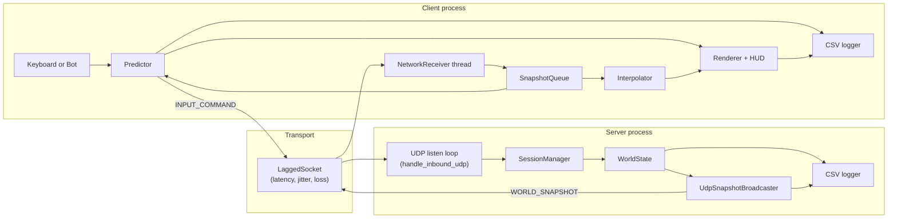
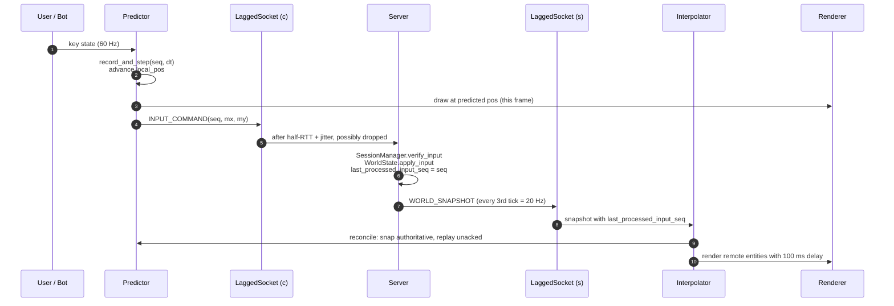
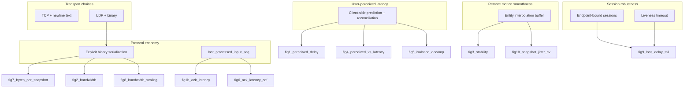
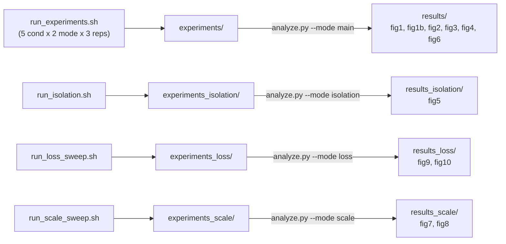

# Lightning Link: Architecture and Optimization Decomposition

This document is the visual companion to the evaluation chapter of the report.
It traces how input travels through the system, where each optimization lives,
and which figure in the results set is the evidence for it.

## 1. Component overview

The baseline (TCP + text) path has the same shape except the transport is a
stream socket, packets are newline-delimited ASCII, there is no predictor or
interpolator, and the conditioner is a small line-level software queue that
lives inside the baseline client itself (`Conditioner` in
[client/tcp_baseline_client.cpp](../client/tcp_baseline_client.cpp)).

## 2. Input round-trip timeline (optimized path)

The `reconcile` step is what decouples perceived delay from wire RTT. Because
the predictor already advanced `local_pos` in step (3), the frame rendered at
step (3) is the one the user perceives - the ack arriving much later only
corrects drift, it does not delay the visible response.

## 3. Where each optimization lives

A claim in the report that "binary serialization gives X% bandwidth savings"
must cite fig2 and fig7. A claim that "client-side prediction hides the
user-visible effect of 100 ms added RTT" must cite fig1, fig4, and fig5. If a
figure is referenced and no arrow in the diagram leads to it, the claim is
not supported by the evaluation.

## 4. Evaluation pipeline

Each orchestration script is self-contained: you can run only the scripts that
produce the figures you cite. Every script reuses the same built binaries and
the same CSV schemas.

## 5. Source-to-figure index

| Optimization             | Source                                                                                                           | Evidence figure(s)                  |
| ------------------------ | ---------------------------------------------------------------------------------------------------------------- | ----------------------------------- |
| UDP + binary transport   | [common/lagged_socket.cpp](../common/lagged_socket.cpp), [common/serialization.cpp](../common/serialization.cpp) | fig2, fig7, fig8                    |
| Client-side prediction   | [client/prediction.cpp](../client/prediction.cpp)                                                                | fig0, fig1, fig4, fig5              |
| Entity interpolation     | [client/interpolation.cpp](../client/interpolation.cpp)                                                          | fig3, fig3b, fig10                  |
| Ack-based reconciliation | `last_processed_input_seq` in [common/serialization.cpp](../common/serialization.cpp)                            | fig0, fig1b, fig5 (noPred vs full)  |
| Endpoint-bound sessions  | [server/session_manager.cpp](../server/session_manager.cpp)                                                      | fig9 (no spurious stalls under loss)|
| Liveness timeout         | [server/session_manager.cpp](../server/session_manager.cpp) `reap_timeouts`                                      | fig9                                |
| Fixed-timestep tick      | [server/world_state.cpp](../server/world_state.cpp) `step_tick`                                                  | fig3, fig3b                         |

When presenting results in the report, group the text by the rows of this
table rather than by figure number - the reader leaves with "what did each
design decision buy us?" which is the question the evaluation is designed to
answer.
